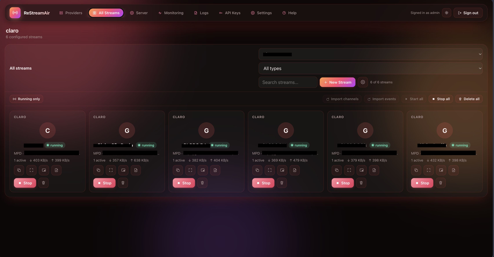
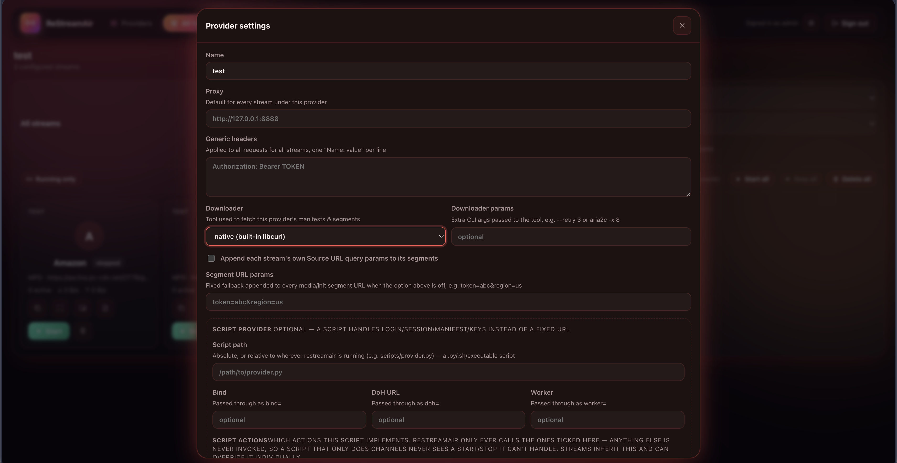
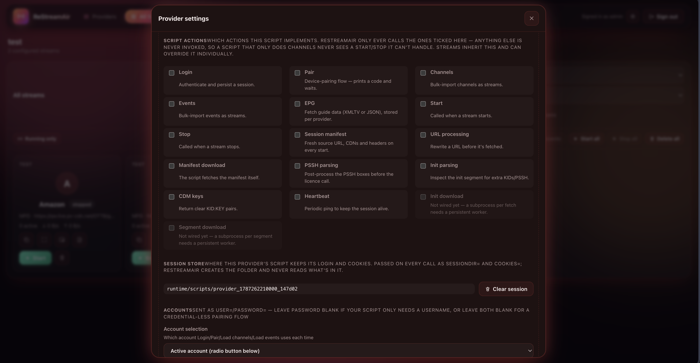
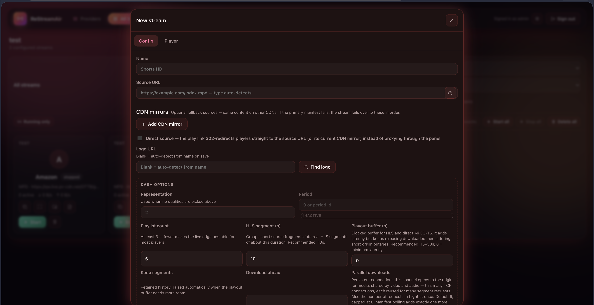

# ReStreamAir

ReStreamAir turns live DASH (`.mpd`) and HLS (`.m3u8`) sources into stable HLS playback URLs. It can download, buffer, decrypt, and remux streams without transcoding, then serve them to VLC, IPTV apps, browsers, or another service.

It is one C/C++ server with a built-in web panel and HTTP API. No JavaScript or Python runtime is required by the server. Provider scripts are optional and only needed for sources that require custom login, channel discovery, short-lived URLs, or external key handling.

## Screenshots







## Quick start

Build and run:

```bash
cmake -S . -B build
cmake --build build -j
./build/restreamair-server --port 8787 --bind 0.0.0.0 --root public
```

Open `http://localhost:8787`, create the first admin account, then:

1. Create a provider.
2. Add a stream and paste its `.mpd` or `.m3u8` URL.
3. Let the source probe finish.
4. Press **Start**.
5. Copy `/play/<stream-id>/index.m3u8` into your player.

A DASH stream may return `503 Retry-After` for a few seconds while its first segments are buffered. Players normally retry automatically.

## What the main objects mean

- A **provider** groups streams that share network settings, credentials, a webhook, or a provider script.
- A **stream** is one channel or event with its own source, quality selection, buffering, headers, decryption, and output settings.
- A **panel account** signs into the management UI and HTTP API.
- A **playback API key** protects viewing URLs. It does not grant panel access.
- A **provider script** handles source-specific work such as login or refreshing an expiring manifest URL.

## Web panel

The top navigation contains:

- **Providers** — create providers, edit shared settings, import/export configurations, and run provider scripts.
- **All Streams** — find, start, stop, edit, or delete streams across providers.
- **Server** and **Monitoring** — host health, bandwidth, active viewers, and connections.
- **Logs** — control-plane, script, manifest, segment, proxy, and pipeline events.
- **API Keys** — create or revoke playback keys.
- **Settings** — server bind settings, panel accounts, FFmpeg status, and service controls.
- **Help** — short explanations and examples available inside the application.

Each view has a stable URL such as `/providers`, `/streams`, `/monitoring`, `/logs`, and `/settings`. Provider and stream filters are kept in the query string, so views can be bookmarked.

## Stream setup

Paste a source URL into the stream editor. ReStreamAir probes it using the configured proxy and manifest headers, detects DASH or HLS, lists video/audio tracks, and reports DRM KIDs found in DASH init segments.

The most useful controls are:

| Setting | Purpose |
|---|---|
| Playlist count | Segments advertised to the player. Minimum 3. |
| HLS segment | Approximate output segment duration. Ten seconds is a good default. |
| Keep count | Old segments retained for players that fall behind. |
| Download ahead | How far the engine prefetches. |
| Parallel downloads | Origin media connections shared across the stream's renditions. |
| Poll seconds | How often a live MPD is refreshed. |
| Playout buffer | Extra delay used to ride through short origin outages. |
| Audio delay | Positive or negative lip-sync correction in milliseconds. |
| Allow static MPD | Permit VOD/offline DASH manifests. |

Selecting multiple video qualities produces an HLS master playlist. The stream URL stays the same.

## Input and output modes

The internal remuxer is the default and does not need FFmpeg. It supports live DASH-to-HLS and HLS passthrough, buffering, CENC clear-key decryption, and HLS AES-128 decryption.

FFmpeg modes run a supervised resident process for inputs or outputs that need it. Program-pipe mode runs a producer and sends its stdout to FFmpeg. The command is argv-based; shell syntax only works when you explicitly invoke a shell.

Some modes shown by the panel are reserved but not fully wired. In particular, N_m3u8DL-RE resident integration and some external output modes may return `501` or an explanatory start error.

## Playback URLs

The canonical URL is:

```text
/play/<stream-id>/index.m3u8
```

Other useful routes:

| Route | Use |
|---|---|
| `/play/<id>/index.mpd` | Generated live DASH view for a DASH stream. |
| `/direct/<id>` | Never-ending raw fMP4 tail. |
| `/direct/<id>.ts` | Never-ending muxed MPEG-TS tail. |
| `/download/<id>/<representation>` | Download the media currently buffered in memory. |
| `/source/<id>` | Redirect to the current source URL. |
| `/api/playlist.m3u8` | Export all streams as M3U. |
| `/api/providers/<id>/playlist.m3u8` | Export one provider as M3U. |
| `/ping` | Unauthenticated health check. |

When at least one playback key exists, pass it as `?key=<key>` or `Authorization: Bearer <key>`. With no playback keys, viewing URLs are open to anyone who can reach the server.

## HTTP management API

Every server-side action in the panel uses the public HTTP API. Automation does not need to click or imitate the UI.

Use a panel admin account with HTTP Basic authentication:

```bash
base=http://127.0.0.1:8787
auth='admin:your-panel-password'

curl --fail-with-body --user "$auth" "$base/api/state"
```

`/api/state` returns provider and stream IDs. Use those IDs in action routes:

```bash
stream_id=stream_...

curl --fail-with-body --user "$auth" -X POST \
  "$base/api/streams/$stream_id/start"

curl --fail-with-body --user "$auth" -X POST \
  "$base/api/streams/$stream_id/stop"
```

Viewer accounts can read management data but receive `403` for writes. Playback API keys cannot access `/api/*`.

See [API.md](API.md) for provider/stream CRUD, probing, imports/exports, logs, users, keys, settings, services, installers, and script actions.

## Provider scripts

Use a provider script only when the source needs custom behavior. Common actions are:

| Action | Purpose |
|---|---|
| `login` / `pair` | Create a provider session. |
| `channels` / `events` | Return streams to import. |
| `epg` | Return guide data. |
| `manifest` | Return a fresh source URL and headers. |
| `start` / `stop` / `heartbeat` | Manage a source-side session. |
| `url`, `downloadmanifest`, `pssh`, `initparse` | Adjust pipeline inputs. |
| `cdm` | Return clear `KID:KEY` pairs from an external key workflow. |

Scripts receive flat `key=value` arguments and print text or JSON. ReStreamAir supplies a durable directory at `runtime/sessions/<provider-id>/`; **Clear session** recursively deletes it.

Start with the short working example in [SCRIPTING.md](SCRIPTING.md#five-minute-example). That guide also shows how to call script actions over HTTP.

## Decryption

For DASH CENC, enter one or more `KID:KEY` hex pairs. A single pair is used for all samples; multiple pairs are matched by KID. Full-sample `cenc`/AES-CTR is supported. `cbcs` pattern encryption is not.

For HLS AES-128, enter the key and optional IV. If the IV is blank, the media sequence number is used as required by HLS.

ReStreamAir does not contain Widevine, PlayReady, or FairPlay CDMs. A provider script may integrate an external authorized key workflow and return clear keys, but ReStreamAir itself does not acquire licenses.

## Authentication and security

Panel accounts have two roles:

- **Admin** — full management access.
- **Viewer** — read-only panel and API access.

Passwords are stored as PBKDF2-HMAC-SHA256 hashes. Session tokens are stored as SHA-256 hashes and survive restarts. Repeated failed sign-ins are throttled per username and client address. The last admin cannot be deleted.

The built-in server is plain HTTP. Use a TLS-terminating reverse proxy when traffic leaves a trusted network. Configure **Trusted proxies** so ReStreamAir can safely use forwarded client addresses and HTTPS status; untrusted forwarded headers are ignored.

`state.json` contains provider-script account passwords, playback keys, and session hashes. Keep it private and back it up securely.

## Install and deploy

### Build requirements

- CMake 3.16+
- A C11/C++17 compiler
- libcurl development files
- libxml2 development files

Debian/Ubuntu:

```bash
sudo apt-get install -y cmake build-essential libcurl4-openssl-dev libxml2-dev
cmake -S . -B build -DCMAKE_BUILD_TYPE=Release
cmake --build build -j
ctest --test-dir build --output-on-failure
```

macOS needs Xcode Command Line Tools plus `brew install libxml2 pkg-config`. Windows builds use the repository's vcpkg manifest.

### Docker

```bash
docker build -t restreamair .
docker run -d --name restreamair \
  -p 8787:8787 \
  -v restreamair-data:/data \
  restreamair
```

`docker-compose.yml` and `deploy/Caddyfile` provide a persistent deployment with TLS proxying. `deploy/restreamair.service` is the systemd unit template.

### Server options

```text
--port N          listening port
--bind ADDRESS    listening address
--root DIR        panel public/ directory
--refresh-web     refresh the cached panel files
--web-ref REF     fetch panel files from a tag, branch, or commit
--no-download     never download panel files
```

Saved port and bind settings apply after restart. Command-line values take precedence.

## Data layout

All mutable data is relative to the working directory:

- `state.json` — configuration, accounts, keys, sessions, and totals.
- `runtime/sessions/<provider-id>/` — provider-script session data.
- `runtime/ffmpeg/<stream-id>/` — resident FFmpeg HLS output when used.
- `logs/` — persisted logs where enabled.
- `logo-cache.json` or `logos.json` — logo lookup cache.

Internal live segments are held in bounded memory, not written to disk.

## Troubleshooting

- **`/play` stays at 503:** open Logs and check the manifest fetch or pipeline start.
- **Players request missing segments:** raise Keep count and possibly Playlist count.
- **Origin returns 403/429:** inspect the logged response, reduce poll frequency or parallel downloads, and verify headers/proxy/account limits.
- **No picture after downloading:** verify the stream's KID/key pair and confirm the encryption mode is `cenc`, not `cbcs`.
- **Audio is out of sync:** adjust Audio delay in the stream editor.
- **Static MPD is rejected:** enable Allow offline/static MPD.
- **A panel action fails from automation:** use `--fail-with-body`; API errors return `{"error":"..."}`.

## Architecture

- `restream_base` contains portable parsing, crypto, state, process, and panel logic.
- `restream_core` contains the HTTP server, live engine, metrics, logs, and playback routing.
- `restreamair-server` registers platform/network handlers and serves the panel.
- `restream_selftest` runs deterministic core tests.
- `scripts/api-smoke.py` starts a real server and tests the management and playback APIs end to end.

## License

See [LICENSE](LICENSE).
